<p align="center">
  <span style="display: inline-block; padding: 0 20px;">
    <a href="https://github.com/nimbly-dev/ph-shoes-extraction-automation">
      
    </a>
  </span>
  <span style="display: inline-block; padding: 0 20px;">
    <a href="https://github.com/nimbly-dev/ph-shoes-dbt-analytics">
      
    </a>
  </span>
  <span style="display: inline-block; padding: 0 20px;">
    <a href="https://github.com/nimbly-dev/ph-shoes-data-spa">
      
    </a>
  </span>
</p>

<p align="center">
  <strong>You are viewing: <code>ph-shoes-data-spa</code> repository</strong><br />
</p>

---

# PH Shoes Data SPA Project Overview

The **PH Shoes Data SPA Project** serves as the user-facing layer of the entire platform. It delivers a modern, responsive web experience built on top of a production-grade backend powered by Spring Boot and a rich frontend using React.

This project is divided into two main components:

##  Backend — Java Spring Boot (v21)

The backend is responsible for exposing APIs that serve product data directly from the Snowflake-transformed model `fact_product_shoes`. It includes:

* **JPA Specification-based Filtering**
  Allows users to search and filter products by brand, gender, age group, price, and more — all dynamically composed at runtime using JPA Criteria Specifications.

* **AI-Powered Search Endpoint**
  Accepts natural language queries (e.g., “cheap running shoes for men”) and processes them via:

  1. **Prompt-based parsing** using OpenAI’s GPT API (to turn the query into structured filters).
  2. **Vector similarity lookup** against Ada-generated embeddings stored in Snowflake.

This hybrid approach supports both structured filtering and semantic search in a unified API layer.

##  Frontend — React + MUI

The frontend is a **single-page application** (SPA) built with React, styled using Material UI (MUI), and fully optimized for mobile responsiveness. It includes:

* A **manual filter UI** (brand, gender, keyword filtering, on sale)
* An **AI search bar** with natural language support
* Pagination, loading states, and a clean card-style product display


---

# PH Shoes Data SPA — API Endpoints

The backend exposes two primary RESTful endpoints to serve shoe product data:

1. **Manual Filtering** via structured query parameters  
2. **AI-Powered Search** via natural-language queries with OpenAI embeddings

### 1. Manual Filtering  
**`GET /api/v1/fact-product-shoes`**

Uses Spring Data JPA’s `JpaSpecificationExecutor` and the Specification pattern to build dynamic `WHERE` clauses. Supports pagination and multiple optional filters in any combination.

#### Core Implementation
- **Repository** implements `JpaSpecificationExecutor<FactProductShoes>`.
- **Controller** builds an initial “true” predicate, then `.and(...)` for each supplied param.
- **Specs** live in `ProductShoesSpecifications` (e.g. `hasBrand()`, `collectedBetween()`, `isOnSale()`, `hasKeyword()`).

#### Supported Query Parameters

| Parameter    | Type         | Notes                                                                 |
|--------------|--------------|-----------------------------------------------------------------------|
| `brand`      | `string`     | Exact match on `brand` (normalized to lowercase, non-alphanumeric stripped) |
| `gender`     | `string`     | Normalized: “men”→`male`, “women”→`female`; kids/children → subtitle   |
| `ageGroup`   | `string`     | e.g. `adult`, `kids`                                                  |
| `date`       | `YYYY-MM-DD` | Single collection date                                                |
| `startDate`  | `YYYY-MM-DD` | Requires `endDate`                                                    |
| `endDate`    | `YYYY-MM-DD` |                                                                        |
| `keyword`    | `string`     | SQL `LIKE` against `title` **OR** `subtitle`                           |
| `onSale`     | `boolean`    | `true` ⇒ `priceSale < priceOriginal`                                   |
| `page`       | `number`     | Zero-based page index                                                  |
| `size`       | `number`     | Items per page (default: 20)                                           |

#### Example Request
```http
GET /api/v1/fact-product-shoes?
    brand=nike&
    onSale=true&
    startDate=2025-06-01&
    endDate=2025-06-10&
    keyword=running&
    page=0&
    size=15
````

#### Example Hibernate Logs

```sql
SELECT fps.*
  FROM fact_product_shoes fps
 WHERE 1 = 1
   AND lower(fps.brand) = ?
   AND fps.price_sale < fps.price_original
   AND lower(fps.title) LIKE ?
   AND fps.dwid = (
       SELECT max(fps2.dwid)
         FROM fact_product_shoes fps2
        WHERE fps2.id = fps.id
     )
 offset ? rows fetch first ? rows only;

SELECT count(*)
  FROM fact_product_shoes fps
 WHERE 1 = 1;
```

---

### 2. AI-Powered Search

**Endpoint**

```
GET /api/v1/fact-product-shoes/search
  ? q={naturalLanguage}
  & page={n}
  & size={m}
```

**Figure: AI Search Flow**

```mermaid
flowchart TD
    A["Client HTTP GET /search?q=(NL)&page=(n)&size=(m)"]
        --> B["Sanitize & Validate (Controller)"]
    B --> C["Extract deterministic filters & leftover text"]
    C --> D["Base FilterCriteria"]
    C --> E["Leftover Text"]
    E --> F["GPT-4 Intent Parsing → Fuzzy Criteria"]
    D & F --> G["Merge + Clear numeric filters if none"]
    G --> H["Normalize Criteria"]
    H --> I{"sortBy = price_asc/desc?"}
    I -- Yes --> J["SQL Fetch & Sortdb.findAll(spec, pageable)"]
    I -- No  --> K["Vector Search:• Fetch capped rows• Embed query• Load embeddings• Cosine-sort• Paginate"]
    J & K --> L["Return Page<FactProductShoes>"]
```



**Flow at a glance**

1. **Sanitize input** (reject illegal chars, HTML-escape)
2. **Pre-filter extraction** → deterministic filters (brand, price, onSale) + leftover text
3. **GPT-4 intent parse** → fuzzy `FilterCriteria` from leftover
4. **Merge & sanitize** → deterministic > fuzzy; **numeric-filter reset** if no digits
5. **Normalize** → standardize brands, gender, keywords
6. **Branch**

    * **`sortBy` set** → direct DB query & sort
    * **else** → semantic **vector search** fallback (embed + cosine + paginate)
7. **Return** a paged result set

**AI Search Terminology**

> **Heuristic vs. AI Trust**
> Simple rule-based heuristics (e.g. strip digits for price hints) act as a safety net; we **only** apply numeric 
> filters if the AI’s parsed JSON explicitly sets them.

> **Numeric-Filter Reset**
> If the raw query has **no digits**, we clear all numeric filters (`priceSaleMin/Max`, `priceOriginalMin/Max`) 
> to avoid unintended constraints.

> **Deterministic vs. Fuzzy**
> Deterministic filters (brand, on-sale, sort keywords) are extracted by 
> pattern; everything **left over** (model names, color words) is handled via GPT-4 fuzzy parsing.


#### Example Request

```http
GET /api/v1/fact-product-shoes/search?
    q=Adidas+Ultraboost+22+on+sale+for+women&
    page=0&
    size=15
```

#### Key Error

* **400 Bad Request** if `q` contains disallowed characters or fails the whitelist.

---

# PH Shoes Catalog — Frontend UI

The **frontend** is a Single Page Application (SPA) built using **React** and styled with **Material UI (MUI)**. It is optimized for both desktop and mobile, allowing users to browse, search, and filter shoe products with ease.

## Manual Filters

Users can filter products by brand, gender, date range, keyword, and sale status. Filter state is fully reactive and synced to backend query parameters.

<p align="center">
  
</p>

<p align="center">
  
</p>

## On-Sale Products

Toggle the “On Sale Only” checkbox to show discounted products.

<p align="center">
  
</p>

## AI-Powered Search

The frontend supports AI-powered search via natural language queries (e.g. “vomero shoes”). These are parsed by the backend using OpenAI and matched with vector embeddings.

<p align="center">
  
</p>

## Mobile-First Responsive Layout

The layout gracefully adapts to mobile screens, stacking filters and product cards vertically for optimal UX.

<p align="center">
  
</p>

---

# Deployment & Hosting

The PH Shoes Data SPA is deployed on [**Render.com**](https://render.com) using Dockerized services for both frontend and backend. The application is live and accessible at:

👉 [https://phshoesproject.com](https://ph-shoes-frontend.onrender.com/)

Both services are built from Docker images and deployed as separate Render web services:

* **Frontend** (React + MUI SPA) is served via NGINX using a static Docker container.
* **Backend** (Spring Boot API) exposes `/api/v1/fact-product-shoes` endpoints with support for both filtered and AI-based queries.

**Note:**
This project is hosted on **Render Free Tier**, so services may spin down when inactive. Initial requests might experience a cold-start delay of \~1-3 minutes, but once warmed up, performance is stable.

