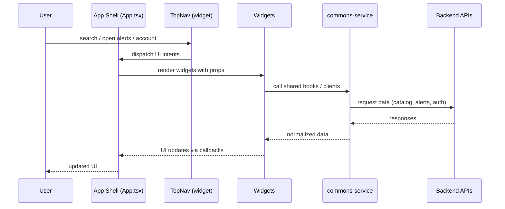

# PH Shoes Data SPA - Frontend Architecture

## Purpose and scope
The SPA is the UI layer for browsing shoes, managing alerts, and handling account
flows. It consumes backend APIs and keeps UI concerns modular by packaging features
as widgets.

## Repo map (frontend)
- App Shell: `ph-shoes-data-spa/apps/web` (App Shell is `src/App.tsx`)
- Shared services and hooks: `ph-shoes-data-spa/packages/commons-service`
- UI primitives and themes: `ph-shoes-data-spa/packages/commons-ui`
- Widget contract types: `ph-shoes-data-spa/packages/widget-runtime`
- Feature widgets: `ph-shoes-data-spa/packages/widgets/*` (including `top-nav`, `account-menu`)

## High-level architecture
```mermaid
flowchart LR
  User[User] --> Shell[apps/web<br/>App Shell (App.tsx)]
  Shell --> Widgets[Feature widgets<br/>packages/widgets/*]
  Shell --> UI[commons-ui<br/>themes, primitives]
  Widgets --> Shared[commons-service<br/>hooks, clients, types]
  Shared --> APIs[Backend services<br/>catalog, user-accounts, alerts, text-search]
  Widgets <--> Contract[widget-runtime<br/>shell <-> widget contract]
```

## High-level flow (runtime)


## Inspiration and ownership model
The widget-based approach mirrors backend microservices: each widget is a small,
owned module with a clear boundary, isolated dependencies, and a focused surface
area. This keeps frontend work parallelizable and prevents a single app shell
from becoming a bottleneck.

This was informed by research into how larger teams split frontend ownership:
feature-based modules let different developers or squads ship independently while
still sharing a common UI system and runtime conventions.

## App Shell responsibilities
- Orchestrates layout and routing for the SPA.
- Owns global UI state needed across widgets (auth gate, dialogs, drawers).
- Lazy-loads widgets and enforces a consistent development standard across them.

The App Shell stays intentionally barebones, but it provides a single, consistent
surface for how widgets are composed, error-handled, themed, and wired into the
page. That baseline lets widgets stay focused on feature behavior rather than
re-implementing app-level conventions.

In this codebase, the App Shell is solely `ph-shoes-data-spa/apps/web/src/App.tsx`.

Primary files:
- `ph-shoes-data-spa/apps/web/src/App.tsx`
- `ph-shoes-data-spa/apps/web/src/shell/widgetRegistry.tsx`

## Widget loading and error containment
Widgets are registered in a central registry and loaded with `React.lazy`.
Each widget is wrapped in an error boundary so a single widget failure does not
take down the whole shell.

- Registry: `ph-shoes-data-spa/apps/web/src/shell/widgetRegistry.tsx`
- Error boundary: `ph-shoes-data-spa/apps/web/src/shell/WidgetErrorBoundary.tsx`

Why `React.lazy`: it keeps the initial bundle small by loading widgets only when
they are rendered, and it aligns with the widget model as independent modules.

## Widget contract
Widgets receive a small, explicit contract from the shell:
- `widgetId`: required stable ID string used by the shell registry, error boundaries,
  and logging.

Widgets are otherwise prop-driven. Shared hooks handle data access and side effects,
keeping widgets decoupled without a shell API bridge.

## Shared services and state
Shared hooks and API clients live in `commons-service` to avoid duplicating logic
inside each widget.

`commons-*` packages exist to centralize shared concerns: common hooks, API
clients, types, and theme primitives so widgets stay consistent without coupling
to each other.

Examples of shared concerns:
- Auth state and login/logout flows.
- Alerts CRUD, refresh, and triggered counts.
- Catalog search controls and pagination.

See: `ph-shoes-data-spa/packages/commons-service/src/hooks`

## Key user flows

### Auth flow (login/register/session timeout)
1. Shell opens `auth-gate` widget when login is required.
2. Auth widget uses shared auth hooks to call user-accounts APIs.
3. Shell reacts to auth state changes and opens account menus or settings widgets.

Touchpoints:
- `ph-shoes-data-spa/apps/web/src/App.tsx`
- `ph-shoes-data-spa/packages/commons-service/src/hooks/useAuth.ts`
- `ph-shoes-data-spa/packages/widgets/auth-gate`

### Catalog search flow
1. Catalog widget renders filters and search input.
2. Filter state is managed via shared search hooks.
3. API requests hit catalog or text-search endpoints.

Touchpoints:
- `ph-shoes-data-spa/packages/widgets/catalog-search`
- `ph-shoes-data-spa/packages/commons-service/src/hooks/useProductSearchControls`

### Alerts flow
1. Shell opens alerts center drawer on demand.
2. Alerts widget lists alerts; editor widget creates/updates.
3. Shared alerts hook handles API calls and refresh.

Touchpoints:
- `ph-shoes-data-spa/packages/widgets/alerts-center`
- `ph-shoes-data-spa/packages/widgets/alert-editor`
- `ph-shoes-data-spa/packages/commons-service/src/hooks/useAlerts`

## Configuration and environment
The shell reads backend endpoints from Vite env vars in `apps/web/.env`:
- `VITE_CATALOG_API_BASE_URL`
- `VITE_USER_ACCOUNTS_API_BASE_URL`
- `VITE_ALERTS_API_BASE_URL`
- `VITE_TEXT_SEARCH_API_BASE_URL`

See: `ph-shoes-data-spa/apps/web/.env`

## Build and dev
- Dev server: `npm run dev` (from `ph-shoes-data-spa`)
- Production build: `npm run build`

See: `ph-shoes-data-spa/package.json`

## Extending with a new widget
1. Create a new widget in `ph-shoes-data-spa/packages/widgets/<widget-id>`.
2. Export the widget entry point from its package.
3. Register it in `ph-shoes-data-spa/apps/web/src/shell/widgetRegistry.tsx`.
4. Wire it into the shell with explicit props and shared hooks.

Guideline: keep widget API surface small and rely on shared hooks for data access.
